# 🐇 RabbitMQ on Docker 🐋

Spin up a full RabbitMQ setup with Docker Compose. Includes pre-configured queues, exchanges, DLQs, management UI, shovel plugin, and basic security. Ideal for local development and testing messaging flows without manual setup.

```mermaid
---
title: RabitMQ
config:
  theme: base
  themeVariables:
    primaryColor: "#ff934c"
    secondaryColor: '#FFE6E6'
    background: "#ff934c"
---

flowchart TD    
subgraph MYVH ["Virtual Host: MYVH"]
    A(🔀 Exchange
          MYVH.MainExchange) -->|🔑MYVH.MainQueue| B(📩 Queue
                                                  MYVH.MainQueue)    
    B(📩 Queue
                                                  MYVH.MainQueue) --> C(🔴 Message Rejection)
    C --> |🔑MYVH.MainQueue.Dlq| D(🔀 Exchange
                                       MYVH.DeadletterExchange)
    D --> |🔑MYVH.MainQueue.Dlq| E(📩 Queue
                                                  MYVH.MainQueue.Dlq) 
end

style MYVH fill:#ffe6e6,stroke:#ff934c,stroke-width:2px;
```

<br/>



<br/>

## ▶️ How to run

Before you get started, make sure Docker is up and running on your machine.

1. Clone this repo to any folder you like
   ```sh
   git clone https://github.com/davydsonverri/rabbitmq-docker-compose.git
   ```
2. Get in the repository folder
   ```
   cd rabbitmq-docker-compose
   ```
3. Startup using docker compose command on daemon mode
   ```
   docker-compose up -d
   ```

<br/>

## 🔐 Credentials

**User:** guest  
**Password:** guest123

### 🔁 Changing the Password

Once your RabbitMQ container is running, you can generate a new password hash with the command below:

```sh
docker exec rabbitmq rabbitmqctl hash_password your_new_password_here
```

You should see something like this in your terminal:

```sh
Will hash password your_new_password_here
yv+9vU83o7DEu3MfK74FGLlQrwxOGFNOhPmIUBf0XfpPdPG9   
```

Then, update the `password_hash` field in your `definitions.json` file:

```json
"users": [
  {
    "name": "guest",
    "password_hash": "oRw25r5d1FRUfrpGueD2bJXm57h8LbslWfhf4gz7xndOafRv",
    "hashing_algorithm": "rabbit_password_hashing_sha256",
    "tags": "administrator"
  }
]
```

<br/>

## 🖥️ Management UI

Access the RabbitMQ Management UI at:  
🔗 [http://localhost:15672](http://localhost:15672)  
Use the credentials provided above.

<br/>

## ⚙️ Customizing Resources

All core RabbitMQ configurations can be customized via the **`definitions.json`** file.  
This file already includes examples of the following:

- 🗂️ Create virtual hosts
- 👤 Create users
- 🛡️ Grat permisions to users
- 🔁 Create exchanges
- 📩 Create queues
- 🔗 Binding queue to exchanges
- ☠️ Set Deadletter exchange a Deadletter routing key
